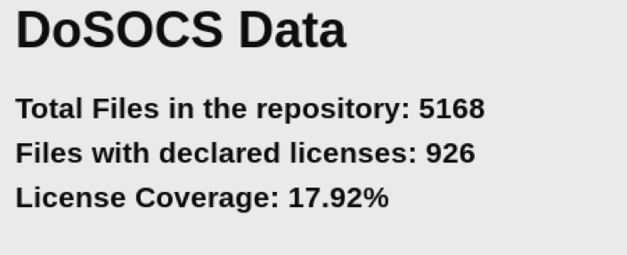

## 1. Description
How much of the code base has declared licenses. This includes both software and documentation source files and is represented as a percentage of total coverage. 

## 2. Use Cases
License Coverage provides insight into the percentage of files in a software package that have a declared license, leading to two use cases: 
1. A software package is sourced for internal organizational use and declared license coverage can highlight points of interest or concern when using that software package. 
2. Further, a software package is provided to external, downstream projects and declared license coverage can make transparent license information needed for downstream integration, deployment, and use. 


## 3. Formula

## 4. Sample Filter and Visualization

### Web Presentation of DoSOCS2 Output: 


### JSON Presentation of DoSOCS2 Output: 


## 5. Sample Implementation

## 6. Known Implementations

## 7. Test Cases (Examples)

## 8. External References (Literature)


----
```markdown
# {Name of Metric}

## 1. Description
A description of what the metric is and what it captures.
The first few sentences have to match the description in the [metrics list](../activity-metrics-list.md).

## 2. Use Cases
Provide examples of how the metric might inform different stakeholders through use cases.

## 3. Formula
A generic formula (in pseudo code) to generate the metric.

## 4. Sample Filter and Visualization
Include a Sample Filter and Visualization (screenshot) of the metric from any implementation.

## 5. Sample Implementation
An example implementation, for example a SQL or Elasticsearch query.

## 6. Known Implementations
Examples of where and how metric is used. (include links to dashboard or location where metric is visible or is talked about having been used).

## 7. Test Cases (Examples)
Sample inputs (including contexts) and expected outputs for this metric. Implementers can test their implementations against these test cases. For quantitative metrics, this could include a static repository with known metric results, or just inputs and output. For qualitative metrics, this may be more difficult.

## 8. External References (Literature)
Blog posts, websites, academic papers, or books that mention the metric.
```
